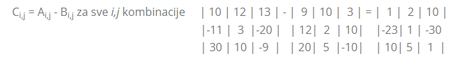

# MANIPULATOR MATRICA #


Ime i prezime: Mateo Kocev

JMBAG: 0303104813

Nota: Kolega Kostić i Pavicchievaz su odustali od projekta.

### Sadržaj ###

1. Matrice
   1. Zašto su nam bitne?
   2. Vrste matrica
2. Kalkulator Matrica (kod)
   1. Zbrajanje
   2. Oduzimanje
   3. Množenje skalarom
   4. Množenje matrica
   5. Transponiranje
   6. Determinanta
   7. Inverz matrica
3. Hillova Šifra (kod)
   1. Šifriranje
   2. Dešifriranje


### Matrice ###

Matrice su pravokutni prikaz podataka (brojeva, varijabla, funkcija, diferencijalnih operatora, itd. ) određene veličine koje definiramo sa količinom redaka (*n*) i stupca (*m*), to jest Matrica (A<sub>n,m</sub>) veličine 2x2 će se zapisati u sljedećem obliku:


Primjer 1.

```
                        j1  j2
            	A2,2 = | 2 | 3 |   i1
                       | 4 | 5 |   i2 
```


Podatke pronađene u matrici nazivamo elementima matrice i označavamo ih (a<sub>i,j</sub>), to jest a<sub>1,2</sub>=3 u našem gornjem primjeru.


#### Zašto su nam bitne? ####

​	Primjene za matrice nalazimo u svakodnevnom životu, dok u matematici ih najlakše primjetimo u zapisivanja linearnih jednadžbi


Primjer 2.


 	2x - y = 0                  možemo zapisati kao           |  2 | -1 | * |  x | = |  0 |
 	-x +2y = 3                                                | -1 |  2 |   |  y |   |  3 |


Konkretnije primjene nalazimo u manipulacijama slika gdje se kernel koristi za promjenu piksela raznim metodama ili u računalnoj grafici za manipuliranje objekta skaliranjem, prevođenjem i rotiranjem objekta. U nekim slučajevima matrice se koriste u elektrotehnici za računanje struje.


Primjer 3.

​	Možemo manipulirati grayscale slike sa jednostavnim nisko propusnim filterom:

```txt
	| 1/9 | 1/9 | 1/9 |
	| 1/9 | 1/9 | 1/9 |
	| 1/9 | 1/9 | 1/9 |
	
```

Kad uzmemo 3x3 odsječak piksela sa slike i svaki element pomnožimo sa našim kernelom, dobivene vrijednosti možemo zbrojiti i spremiti u srednji piksel. Ovaj proces se ponavlja pomicajući se za jedan piksel u redu dok ne prođemo cijelu sliku što će nam dati mutniju sliku


#### Vrste matrica ####


**Dijagonalna matrica** je slučaj di broj retka je jednak broju stupca, to jest *n* = *m*


**Dijagonalna matrica** je kvadratna matrica kojoj su svi elementi izvan glavne dijagonale jednali nuli, to jest a<sub>i,j</sub> = 0 ako *i* ≠ *j*.


**Gornja trokutasta matrica** je kvadratna matrica kojoj su svi elementi ispod glavne dijagonale jednaki nuli, to jest a<sub>i,j</sub> = 0 ako je *i* > *j*.
	Suprotno nalazimo **donju trokutastu matricu** gdje a<sub>i,j</sub> = 0 ako je *i* < *j*.


**Jedinična matrica** (*I*) je kvadratna matrica kojoj su svi elementi na glavnoj dijagonali jednaki jedinici, to jest ako je pomnožimo sa bilo kojom odgovarajućom matricom (A) dobit ćemo tu matricu, to jest ***IA = A*** i ***AI = A***. Svojstva elementa glase a<sub>i,j</sub> = 1 ako je *i* = *j* dok a<sub>i,j</sub> = 0 kad  *i* ≠ *j*. 


### Kalkulator matrica (kod) ###


#### Zbrajanje ####

​	Da bi smo mogli zbrajati matrice, veličina prve matrice (A<sub>n,m</sub>) mora biti jednaka veličini druge matrice(B<sub>n,m</sub>), jednom zadovoljen uvjet možemo svaki podatak iz matrice A zbrojiti sa podatkom iz matrice B koji se nalazi na istoj poziciji.


​	Primjer 4.


Poziv funkcije:

```python
            #Prva matrica
            print("#### ZBRAJANJE ####\n Upiši veličinu prve matrice (` 2 2 ` za matricu veličine 2 puta 2): ")
            matx = Matrice(input())
            print("Unesi prvu matricu (` 2 2 ` pa sa enter za sljedeci redak):")
            matx.novamat()
            #Druga matrica
            print("Upiši veličinu druge matrice: ")
            maty = Matrice(input())
            print("Unesi drugu matricu: ")
            maty.novamat()
            
            print("Rezultat je:")
			matx.zbrajanje(maty)
```

Funkcija:

```python
    def zbrajanje(self, mat):
        if self.red == mat.red and self.kolona == mat.kolona:
            rezultat = [[self.matrica[x][y] + mat.matrica[x][y] for y in range(len(self.matrica))] for x in
                      range(len(self.matrica))]
            for red in rezultat:
                for broj in red:
                    print(broj , end=" ")
                print()
        else:
            print("Operacija nije moguća, dimenzije se ne usklađuju!")
```

U našem kodu provjeravamo da matrice imaju istu veličinu retka i kolona preko if-else selekcije.
Ako vrati True:

​		Granana ```for``` petlja će iterirati kroz naše matrice i zbrajati podatke koje nalazimo na istom indeksu ```[x][y]``` ovisno o dužini naših matrica i spremati 		naše rezultate u listu ```rezultat```. Nakon računanja imamo drugu grananu petlju za ispisivanje rezultata.

Ako vrati False:

​		Python će ispisati ```"Operacija nije moguća, dimenzije se ne usklađuju!"```


#### Oduzimanje ####

​	Isto kao zbrajanje, da bi smo mogli oduzimati matrice, veličina prve matrice (A<sub>n,m</sub>) mora biti jednaka veličini druge matrice(B<sub>n,m</sub>), jednom zadovoljen uvjet možemo svaki podatak iz matrice B oduzezi od podatka iz matrice A koji se nalazi na istoj poziciji.


Primjer 5.





Poziv funkcije:

```python
            #Prva matrica
            print("#### ODUZIMANJE ####\n Upiši veličinu prve matrice (` 2 2 ` za matricu veličine 2 puta 2): ")
            matx = Matrice(input())
            print("Unesi prvu matricu (` 2 2 ` pa sa enter za sljedeci redak):")
            matx.novamat()
            #Druga matrica
            print("Upiši veličinu druge matrice: ")
            maty = Matrice(input())
            print("Unesi drugu matricu: ")
            maty.novamat()
            
            print("Rezultat je:")
            matx.oduzimanje(maty)
```

Funkcija:
```python
    def oduzimanje(self, mat):
        if self.red == mat.red and self.kolona == mat.kolona:
            rezultat = [[self.matrica[x][y] - mat.matrica[x][y] for y in range(len(self.matrica))] for x in
                      range(len(self.matrica))]
            for red in rezultat:
                for broj in red:
                    print(broj , end=" ")
                print()
        else:
            print("Operacija nije moguća, dimenzije se ne usklađuju!")
```

Kao i kod zbrajanja, provjeravamo da matrice imaju istu veličinu retka i kolona preko if-else selekcije.
Ako vrati True:

​		Granana ```for``` petlja će iterirati kroz naše matrice i oduzimati podatke iz matrice ```self.matrica``` koje nalazimo na istom indeksu ```[x][y]``` ovisno o 		dužini naših matrica. Spremamo naše rezultate u listu ```rezultat```. Nakon računanja imamo drugu grananu petlju za ispisivanje rezultata.

Ako vrati False:

​		Python će ispisati ```"Operacija nije moguća, dimenzije se ne usklađuju!"```


#### Množenje skalarom ####

​	Možemo pomnožiti matricu (A) sa nama potrebnim brojem koji nazivamo skalar (λ) kako bi smo dobili skalarni produkt (λA). Skalarni produkt dobijamo množenjem svakog elementa u matrici sa skalarom, rezultat će biti iste veličine kao matrica (A)


Primjer 6.


Poziv funkcije:

```python
            print("#### MNOŽENJE MATRICE SA SKALAROM ####\n Upiši veličinu matrice koju hočeš pomnožiti (` 2 2 ` za matricu veličine 2 puta 2): ")
            matx = Matrice(input())
            print("Unesi matricu (` 2 2 ` pa sa enter za sljedeci redak):")
            matx.novamat()
            #unos skalara
            print("Unesi skalar po izboru: ")
            skal = float(input())
            
            print("Rezultat je:")
            matx.skalar(skal)
```

Funkcija:

```python
    def skalar(self, skalar):
        rezultat = [[self.matrica[x][y] * skalar for y in range(len(self.matrica))] for x in range(len(self.matrica[0]))]
        for red in rezultat:
            for broj in red:
                print(broj , end=" ")
            print()
```

Pošto nemamo dvije matrice, u ovom slućaju nam veličina matrice nije važna tako da naša funkcija nema selekciju.

Kako bi smo dobili rezultat imamo dvije ```for``` petlje koje množe svaki ```[x][y]``` element sa skalarom i sprema rezultat direktno u dvodimenzionalnu listu ```rezultat```

Kao u prijašnjim funkcijama imamo grananu petlju za ispisivanje rezultata spremljenog u listi.


#### Množenje matrica ####

​		Za razliku od ostalih osnovnih operacija, množenje je malo kompliciranije i zahtjeva više računanja. Kako bi smo pomnožili dvije matrice, prva matrica (A) mora imati kolona koliko i druga matrica (B) ima redaka, to jest A<sub>n,m</sub> * B<sub>m,p</sub> = C<sub>n,p</sub> što znači da rezultat matrica(C) će imati količinu redaka iz matrice A i količinu kolona iz matrice B. Množenje matrica NIJE komutativno!


Primjer 7.


c<sub>1,1</sub>= (a<sub>1,1 </sub>* b<sub>1,1</sub>) + (a<sub>1,2</sub> * b<sub>2,1</sub>) + (a<sub>1,3</sub> * b<sub>3,1</sub>)

c<sub>1,2</sub>= (a<sub>1,1</sub> * b<sub>1,2</sub>) + (a<sub>1,2</sub> * b<sub>2,2</sub>) + (a<sub>1,3</sub> * b<sub>3,2</sub>)

c<sub>1,3</sub>= (a<sub>1,1</sub> * b<sub>1,3</sub>) + (a<sub>1,2</sub> * b<sub>2,3</sub>) + (a<sub>1,3</sub> * b<sub>3,3</sub>)

c<sub>2,1</sub>= (a<sub>2,1</sub> * b<sub>1,1</sub>) + (a<sub>2,2</sub> * b<sub>2,1</sub>) + (a<sub>2,3</sub> * b<sub>3,1</sub>)

...

c<sub>3,3</sub>= (a<sub>3,1</sub> * b<sub>1,3</sub>) + (a<sub>3,2</sub> * b<sub>2,3</sub>) + (a<sub>3,3</sub> * b<sub>3,3</sub>)

​		Množimo elemente u retku i elemente u koloni te njihove produkte zbrajamo i spremamo svaki dobiveni element u novoj matrici (C).


Poziv funkcije:

```python
#Prva matrica
print("#### MNOŽENJE MATRICA ####\n Upiši veličinu prve matrice koju hočeš pomnožiti (` 2 2 ` za matricu veličine 2 puta 2): ")
matx = Matrice(input())
print("Unesi prvu matricu (` 2 2 ` pa sa shift+enter za sljedeci redak):")
matx.novamat()
#Druga matrica
print("Upiši veličinu druge matrice: ")
maty = Matrice(input())
print("Unesi drugu matricu: ")
maty.novamat()
            
print("Rezultat je:")
matx.mnozenje(maty)
```

Funkcija:

```python
def mnozenje(self, mat):
	if self.kolona != mat.red:
    	print("Operacija nije moguća, dimenzije se ne usklađuju!")
    else:
    	rezultat = [[sum(x*y for x,y in zip(self.matrica_red, mat.matrica_kolona)) for mat.matrica_kolona in zip(*mat.matrica)] 																						for self.matrica_red in (self.matrica)]
        for red in rezultat:
        	for broj in red:
            	print(broj, end=" ")
            print()
```

Sa ```if``` selekcijom provjeravam ako se dimenzije stupca prve matrice i rekada druge matrice usklađu.

Ako vrati True:

​		Python će ispisati ```"Operacija nije moguća, dimenzije se ne usklađuju!"```

Ako vrati False:

​		Pokrenuti će se granana ```for``` petlja koja iterira potrebne kroz naše matrice.

​		Radi sumu produkta elementa spremljenih u ```zip(self.matrica_red, mat.matrica_kolona)``` za svaku kolonu u rasponu zip(*mat.matrica) i sprema 		podatak u listu ```rezultat```. Taj se proces ponavlja kroz sve retke  u ```self.matrica```

​		Na kraju imamo grananu petlju za ispisivanje rezultata spremljenog u listi.


#### Transponiranje ####

​		Transponiranje matrice je jednostavno, trebamo razmjeniti retke i kolone određene matrice, to jest A<sub>i,j</sub> = A<sup>T</sup><sub>j,i</sub>


Primjer 8.


Kada radimo operacije sa transponiranim matricama moramo paziti na određena svojstva:

1. (A+B)<sup>T</sup>= A<sup>T</sup> + B<sup>T</sup>
2. (λA)<sup>T</sup> = λ * A<sup>T</sup>
3. (AB) = B<sup>T</sup> * A<sup>T</sup>
4. det(A)<sup>T</sup> = detA
5. (A<sup>-1</sup>)<sup>T</sup> = (A<sup>T</sup>)<sup>-1</sup>


Poziv funkcije:

```python
            print("#### TRANSPONIRANJE MATRICE ####\n Upiši veličinu matrice koju hočeš transponirati (` 2 2 ` za matricu veličine 2 puta 2): ")
            matx = Matrice(input())
            print("Unesi matricu: ")
            matx.novamat()
            #Pozivanje funkcije za transponiranje
            print("Transponirana matrica je: ")
            matx.transponiranje()
```

Funkcija:

```python
        rezultat = [[self.matrica[x][y] for x in range(len(self.matrica))] for y in range(len(self.matrica))]
        for red in rezultat:
            for broj in red:
                print(broj , end=" ")
            print()
```

Funkcija je jednostavna sama po sebi, imamo grananu ```for``` petlju koja iterira kroz kolone i sprema elemente u novi red ```rezultat``` ugniježdene liste.

Nakon toga imamo drugu grananu petlju za ispisivanje rezultata.


#### Determinanta ####

​		Za računanje determinante (det(A)) koristiti ćemo Laplaceovu ekspanziju što je formula koja nam omogućuje da izrazimo determinantu matrice(A) kao linearnu kombinaciju determinanti manjih matrica, koje se nazivaju minori (A<sub>i,j</sub>)


Primjer 9.


Poziv funkcije:

```python
            print("#### PRONALAŽENJE DETERMINANTE ####\n Upiši veličinu matrice od koje hočeš naći determinantu, matrica mora biti kvadratna (` 2 2 ` za matricu veličine 2 puta 2): ")
            matx = Matrice(input())
            print("Unesi matricu: ")
            matx.novamat()
            #Pozivanje funkcije za determinantu, veoma komplicirano za objasniti jer koristi rekurzivne funkcije i da bar sam ja ovo izmislio al bogme nisam jer sam ga našao online i proučavao satima
            print("Determinanta tražene matrice: ")
            print(matx.determinanta(matx.matrica))
```

Funkcija:

```python
    def determinanta(mat):
        if len(mat) == 1:
            return mat[0][0]
        elif len(mat) == 2:
            determinanta = mat[0][0] * mat[1][1] - mat[1][0] * mat[0][1]
            return determinanta
        else: #koristimo laplace expansion ili cofactor expansion vise na : https://www.statlect.com/matrix-algebra/Laplace-expansion-minors-cofactors-adjoints
            rekdet = 0
            for x, y in enumerate(mat):
                rekrez = mat[0][x] * Matrice.determinanta([[element for indeks, element in enumerate(rekmat) if indeks != x] for rekmat in mat[1:]])
                if x % 2 == 0:
                    rekdet = rekdet + rekrez
                else:
                    rekdet = rekdet - rekrez
            return rekdet
```

Poziv funkcije pokreće provjeru veličine matrice sa ```if``` selekcije

​		Ako je dužina matrice 1x1 onda sama determinanta je elemnt koji nalazimo

​		Ako je dužina matrice 2x2 onda primjenjujemo formulu det(A) = ad-bc, to jest pomnožimo potrebne elemente na određenim indeksima i dobijemo 		traženu determinantu

Ako ni jedan od gornjih uvjeta nije zadovoljen prelazimo na ```else```:

​		Imamo pomoćnu varijablu u koju spremamo našu determinantu, pokreće se for petlja koja iterira preko gornjeg reda naše matrice i raćuna našu		privremenu determinantu. Za rezultat privremene vrijednosti množimo svaki element prvog reda sa determinantom minore koju dobivamo preko 		poziva rekurzivne funkcije. Nakon što smo dobili našu privremenu determinantu provjerimo na kojem se indeksu nalazi, ```if```selekcijom provjerimo 		indeks kako bi odredili predznak i zbrojimo ili oduzmemo sa našom pomoćnom varijablom.


#### Inverz matrice ####

​		Inverz je poseban slučaj koji možemo izračunati samo ako je njena matrica regularna, to jest ako je matrica kvadratna i njena determinanta nije jednaka nuli A<sub>n,m</sub> ako *n* = *m* i detA ≠ 0. Kako bi dokazali da je inverz točan možemo je pomnožiti sa vlastitom matricom i trebali bi dobiti Jediničnu matricu, to jest ***A<sup>-1</sup>A = I*** i ***AA<sup>-1</sup> = I***. Matrice koje nemaju inverz nazivamo singularne matrice. Računamo Inverz koristeći minore (M) , matrice kofaktora (C<sub>A</sub>) i adjungirane matrice (adj A).


Primjer 10.


Poziv funkcije:

```python
            print("#### INVERZ MATRICE ####\n Upiši veličinu matrice od koje hočeš naći determinantu, matrica mora biti 					kvadratna (` 2 2 ` za matricu veličine 2 puta 2): ")
            matx = Matrice(input())
            print("Unesi matricu: ")
            matx.novamat()
            
            print("Inverz matrica je: ")
            Matrice.inverz(matx.matrica)
```

Funkcija:

```python
    @staticmethod
    def minor(matx, x, y):
        return [red[:y] + red[y+1:] for red in (matx[:x]+matx[x+1:])]
    
    
    @staticmethod
    def traninv(spon):
        return map(list,zip(*spon))


    def inverz(self):
        if Matrice.determinanta(self) == 0:
            print("Naša matrica nema inverz, determinanta je 0")
        else:
            if len(self) == 2:
                det2x2 = Matrice.determinanta(self)
                inverz2x2 = []
                inverz2x2 = ([[round(float(self[1][1]/det2x2),2), round(float((-1*self[0][1])/det2x2),2)],[round(float((-1*self[1][0])/det2x2),2), round(float(self[0][0]/det2x2),2)]])
                for red in inverz2x2:
                    for broj in red:
                        print(broj , end=" ")
                    print()
            else:
                inverz = []
                for x in range(len(self)):
                    kofaktor = []
                    for y in range(len(self)):
                        minormat = Matrice.minor(self, x, y)
                        kofaktor.append((((-1) ** (x+y))) * Matrice.determinanta(minormat))
                        
                    inverz.append(kofaktor)
                inverz = list(Matrice.traninv(inverz))
                for x in range(len(inverz)):
                    for y in range(len(inverz)):
                        inverz[x][y] = inverz[x][y]/Matrice.determinanta(self)   
                for x in inverz:
                    for y in x:
                        print(round(y,2) , end=" ")
                    print()
```

Na pozivu funkcije se provjerava je li determinanta nula.

Ako vrati True:

​		Python ispiše ```"Naša matrica nema inverz, determinanta je 0"```

Ako vrati False:

​		Pokreće se druga selekcija koja provjerava veličinu matrice.

​		Ako je 2x2:

​				Izračunamo determinantu i u listu ```inverz2x2``` spremimo naš inverz mijenjajući poziciju elementa van dijagonale, promijenimo im predznak i 				podjelimo sve elemente sa determinantom

​		Ako je veća matrica:

​				Imamo grananu for petlju koja stvara matricu kofaktora računajući kofaktor svakog elementa uz pomoć pomočne funkcije za stvaranje minora.

​				Transponira se matrica sa drugom pomoćnom funkcijom i svaki element nove matrice se podijeli sa determinantom početne matrice.

Na kraju imamo grananu petlju za ispisivanje rezultata.


### Hillova šifra ###

Lester Hill je 1929. godine izumio kriptosustav kod kojeg se *m* uzastopnih slova otvorenog teksta zamjenjuje s *m* slova u šifratu. Dakle, radi se o poligramskoj šifri. Ukoliko broj slova u originalnom otvorenom tekstu nije djeljiv s *m*, poruku trebamo nadopuniti da bismo je mogli podijeliti u blokove od po *m* slova

Hill je preporučio uporabu involutornih matrica, tj. onih kod kojih je *K*<sup>-1</sup> = *K*. To teoretski smanjuje sigurnost, jer je prostor ključeva manji, ali olakšava postupak šifriranja i dešifriranja.

Uvodi se korespodencija izmedu slova engleskog alfabeta (A – Z) koji se smatra medunarodnim alfabetom i cijelih brojeva (0 – 25) na sljedeći način:

A=0, B=1, C=2, D=3, E=4, F=5, G=6, H=7, I=8, J=9, K=10, L=11, M=12, N=13, O=14, P=15, Q=16, R=17, S=18, T=19, U=20, V=21, W=22, X=23, Y=24, Z=25

Ključ mora biti regularna matrica i njena determinanta nesmije bili dijeljiva sa 2 ili 13


#### Šifriranje ####

​		Šifriranje je jednostavno, rastavimo otvoreni tekst na slogove od 3 slova (ako nam fali u zadnjem slogu moramo nadopuniti) i svaki slog pretvorimo u vektor veličine 3x1. Na kraju pomnožimo kljuć (K) sa vektorom (v), i nađemo ostatak za svaki element u rezultatu


Primjer 11.


Poziv funkcije:    

```python
            print("#### HILLOVA ŠIFRA / KODER ####\n Ključ mora biti kvadratna matrica duljine 3 puta 3")
            print("Unesi ključ: ")
            kljuc = []
            kljuc = Hill.novikljuc(kljuc)
            print(kljuc)
            print(Matrice.determinanta(kljuc))
            if Matrice.determinanta(kljuc) != 0:
                print("determinanta nije 0")
                if Matrice.determinanta(kljuc)%2!=0:
                    print("determinanta nije modulo 2")
                    if Matrice.determinanta(kljuc)%13!=0:
                        print("determinanta nije modulo 13")
                        rijec = str(input("Daj mi riječ: "))
                        rijec = Hill.rastav(rijec)
                        Hill.kriptiranje(kljuc, rijec)
            else:
                print("Ključ ne zadovoljava uvjete! Determinanta ")
```

Funkcija:

```python
    def provchar(slovo):
        symbols = [' ', '!', '#', '$', '%', '&', '"', '(', ')', '*', '+', ',', '-', '.', '/', ':', ';', '<', '=', '>', '?', '@', '[', ']', '^', '', '`', '{', '|', '}', '~',"'"]
        for char in slovo:
            if char in symbols:
                return True
            return False
    
    @staticmethod
    def rastav(recenica):
        pomrec = []
        for x in recenica:
            if Hill.provchar(x):
                continue
            else:
                pomrec.append(ord(x.upper())%65)
        return pomrec
    
    @staticmethod
    def kriptiranje(kljucfin, fraza):
        pomocni = []
        privremeni = 0
        sifrat = ''
        
        while len(fraza) >= 0:
            if len(fraza) == 0:
                break
            if len(fraza) == 2:
                fraza.append(0)
            elif len(fraza) == 1:
                fraza.append(0)
                fraza.append(0)
            for x in range(3):
                privremeni = 0
                for y in range(3):
                    privremeni += kljucfin[x][y]*fraza[y]
                pomocni.append(privremeni%26) 
            fraza.reverse()
            fraza.pop()
            fraza.pop()
            fraza.pop()
            fraza.reverse()
        
        sifrat = ''.join(chr(slovo+65) for slovo in pomocni)
        print(sifrat)
```

Napravili smo dvije pomočne funkcije:

Jedna provjerava char po char u stringu i pomoću druge funkcije provjerava da li char posebni simbol ili obično slovo. Nakon provjere funkcija pretvori slovo u veliko slovo i unese ga u novo polje u obliku broja.

Glavna funkcija poziva ključ i otvoreni tekst ```fraza``` već obrađen pomoćnom funkcijom.

Sa ```while``` petljom iterira kroz otvoreni tekst ```fraza``` svaki put provjeravajući ako je vektor duljine 3 (u slućaju da fali slovo vektor se nadopuni nulom).

u while petlji imamo grananu for petlju koja obavlja množenje i nađe ostatak od izračunanog elementa prije nego ga pridruži listi ```pomocni```.

Nakon računanja, otvorenom tekstu ```fraza``` brišemo 3 broja i pokrećemo ponovo proces dok ```fraza``` nije prazan.

Na kraju, na pomoćni string pridružimo brojeve pretvorene u šifrat.


### Dešifriranje ###

​		ukoliko je poznat ključ K i *m*, dešifriranje se provodi koristeći inverznu matricu K<sup>−1</sup>. 


Primjer 12.

​		Kako bi našli K<sup>−1</sup> moramo pronaći multiplikativni inverz naše determinante(d<sup>-1</sup>) i adjungiranu matricu (adj A), tj. K<sup>−1</sup> = (d<sup>-1</sup>adj A)(mod26)

​		Znamo da adj A = (C<sub>A</sub>)<sup>T</sup>

​		Nakon što smo našli K<sup>-1</sup> možemo napokon sa istim procesom kriptiranja pomnožiti sa slogovima šifrata i dobiti rezultat


Poziv funkcije:

```python
            print("#### HILLOVA ŠIFRA / DEKODER ####\n Ključ mora biti kvadratna matrica duljine 3 puta 3")
            print("Unesi ključ: ")
            kljuc = []
            kljuc = Hill.novikljuc(kljuc)
            print(kljuc)
            print(Matrice.determinanta(kljuc))
            if Matrice.determinanta(kljuc) != 0:
                print("determinanta nije 0")
                if Matrice.determinanta(kljuc)%2!=0:
                    print("determinanta nije modulo 2")
                    if Matrice.determinanta(kljuc)%13!=0:
                        print("determinanta nije modulo 13")
                        sifra = str(input("Daj mi šifrat: "))
                        sifra = Hill.rastav(sifra)
                        Hill.dekriptiranje(kljuc, sifra)
                else:
                    print("Ključ ne zadovoljava uvjete! Determinanta ")
```

Funkcija:

```python
    @staticmethod
    def multiverz(determ):
        multinv = 0
        for x in range(26):
            if (x*determ)%26 == 1:
                multinv = x
        return multinv

    @staticmethod
    def inverzkljuc(invmat):
        detkljuc= Matrice.determinanta(invmat)
        invdet = Hill.multiverz(detkljuc)
        
        pomocni = []
        for x in range(len(invmat)):
            kofaktor = []
            for y in range(len(invmat)):
                minormat = Matrice.minor(invmat, x, y)
                kofaktor.append((((-1) ** (x+y))) * Matrice.determinanta(minormat))
                    
            pomocni.append(kofaktor)
        pomocni = list(Matrice.traninv(pomocni))
        zavrsni = [[0, 0, 0], [0, 0, 0], [0, 0, 0]]
        for x in range(3):
            for y in range(3):
                zavrsni[x][y] = (invdet * pomocni[x][y])%26
        return zavrsni
                

    @staticmethod
    def dekriptiranje(kljucfin, sifrat):
        kljucfin = Hill.inverzkljuc(kljucfin)
        pomocni = []
        privremeni = 0
        sifrato = ''
        print(kljucfin)
        print(sifrat)
        while len(sifrat) >= 0:
            if len(sifrat) == 0:
                break
            if len(sifrat) == 2:
                sifrat.append(0)
            elif len(sifrat) == 1:
                sifrat.append(0)
                sifrat.append(0)
            for x in range(3):
                privremeni = 0
                for y in range(3):
                    privremeni += kljucfin[x][y]*sifrat[y]
                pomocni.append(privremeni%26)
                print(pomocni)
            sifrat.reverse()
            sifrat.pop()
            sifrat.pop()
            sifrat.pop()
            sifrat.reverse()
        sifrato = ''.join(chr(round(slovo)+65) for slovo in pomocni)
        print(sifrato)
```

Imamo dvije pomoćne funkcije od kojih 1 pronalazi multiplikativni inverz determinante a druga inverz ključa.

Inverz ključa nalazimo množenjem adjungirane matrice sa multiplikativnim inverzom determinante. Za kraj pronađemo ostatak svih elementa u kljuću.

Nakon što smo pronašli inverz kljuća, primjenjujemo isti proces ko u šifriranju i dobijamo traženi otvoreni tekst.


### Izvori ###

https://pyshark.com/calculate-inverse-of-a-matrix-using-python/

https://wiki.xfer.hr/multiplikativni_inverz/

https://crypto.interactive-maths.com/hill-cipher.html

https://repozitorij.mathos.hr/islandora/object/mathos%3A281/datastream/PDF/view

https://www.nku.edu/~christensen/1402%20Hill%20cipher%20part%20II.pdf

https://web.math.pmf.unizg.hr/~duje/kript/hill.html

A. Dujella, M. Maretic´, Kriptografija, Element, Zagreb, 2007.

https://books.google.hr/books?hl=hr&lr=&id=ywndDQAAQBAJ&oi=fnd&pg=PT5&dq=matrices&ots=OU68u6uT7u&sig=61PDcntAaEQcFicZvLg4F3yLYNo&redir_esc=y#v=onepage&q=matrices&f=false

https://www.cambridge.org/core/journals/mathematical-gazette

Strang, G., Introduction to Linear Algebra, Wellesley-Cambridge Press, 2016.

https://www.youtube.com/playlist?list=PL49CF3715CB9EF31D
